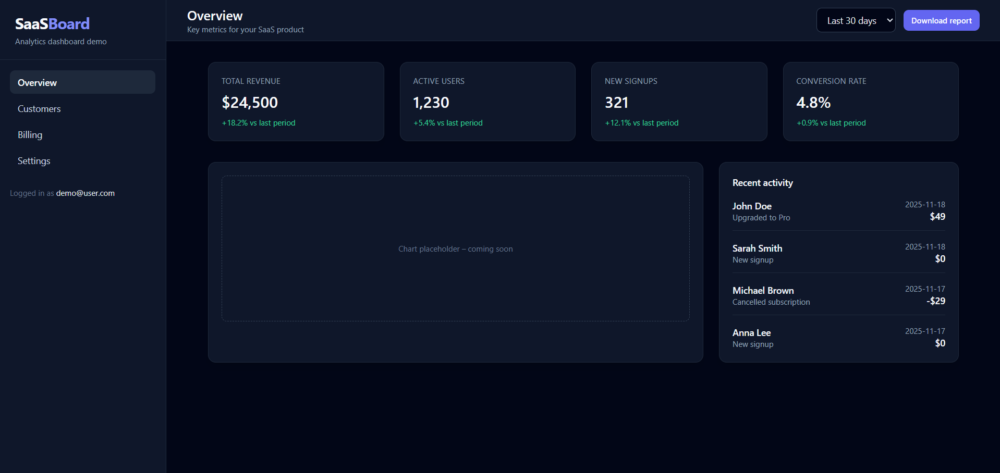

# SaaS Dashboard (Frontend Only)

A modern and responsive **SaaS analytics dashboard** built with **Next.js** and **Tailwind CSS**.  
This project is part of a larger portfolio set and represents a clean, production-ready UI layout for a SaaS product.

🔗 **Live Demo:** https://saas0dashboard.netlify.app/  
📦 **GitHub Repo:** https://github.com/NikolaLaboski/saas-dashboard

---

## 🚀 Tech Stack

- **Next.js (App Router)**
- **React**
- **Tailwind CSS**
- Fully responsive UI
- Deployed on **Netlify**

---

## 📊 Features

### ✅ Dashboard Overview
- KPI cards (Revenue, Users, Signups, Conversion)
- Chart placeholder (future charts supported)
- Recent activity feed

### ✅ Sidebar Navigation
- Overview  
- Customers  
- Billing  
- Settings  

### ✅ Layout Details
- Dark theme  
- Smooth spacing + modern design  
- Mobile-friendly grid layout  
- Clean code structure using components

---

## 🖼️ Screenshot

